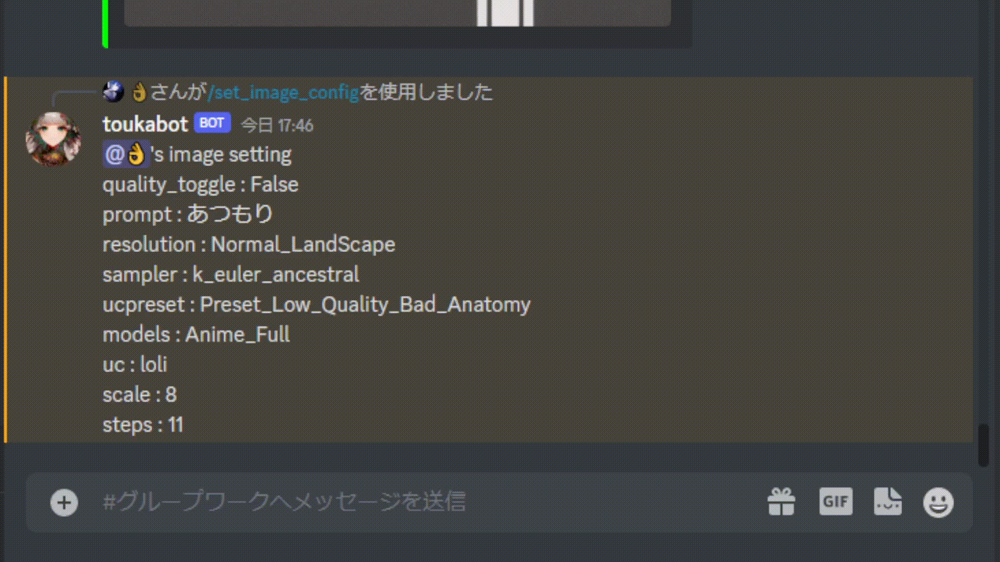

### これは何？

ngrokによってホストされているDiscordBotです。NOVELAIのAPIを叩いて画像生成を行います

**環境**

- raspberry pi 4 model b
- Distributor ID: Debian
- Release:  11
- 64bit
- arrch64

Node-JS
- 18.12

Python
- 3.10
依存環境の関係により3.11以上では動作しない

**備忘録**

[ラズパイで鯖を立てる - notion](https://eastern-scapula-62e.notion.site/2f4819e6d1a04cf9afa80aa0ecb90a88)

**reference**

NovelAI API
- https://github.com/Aedial/novelai-api
